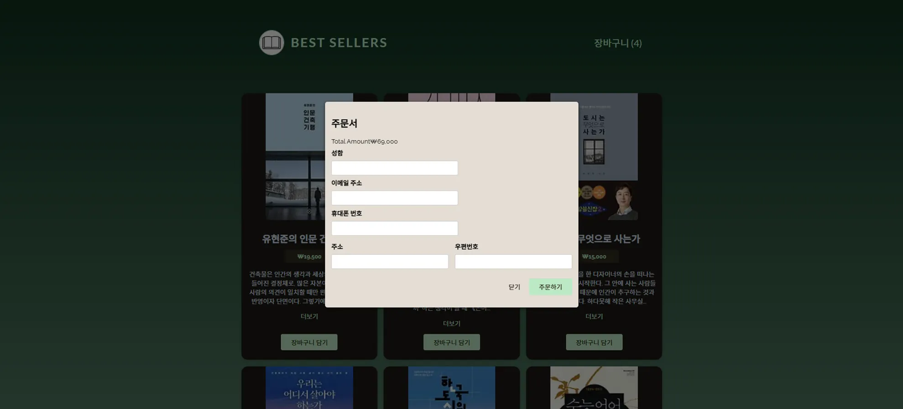

## 상세 내용

- **도서 정보 제공**: Kakao Book API 연동을 통해 실시간 도서 정보 제공
- **장바구니 기능**: React Context를 활용한 전역 상태 관리

## 주요 개발 내용

### 프론트엔드 (React + Vite)

- **React Context API**로 사용자 진행 상태 관리
- **컴포넌트 기반 UI 설계**로 재사용 가능한 구조 설계
- **Vite 기반 프로젝트 구성**으로 빠른 개발 환경 설정 및 빌드 성능 향상
- ESLint + React Hooks 룰을 활용한 코드 품질 관리

### 백엔드 (Node.js + Express)

- **RESTful API 서버 구현**
    - 주문 요청 처리, 도서 목록 반환 등 핵심 API 구현

---

## 기술 스택

- **Frontend**: React, Vite, Context API
- **Backend**: Node.js (Express)
- API 연동: Kakao Book API
- 상태 관리: React Context